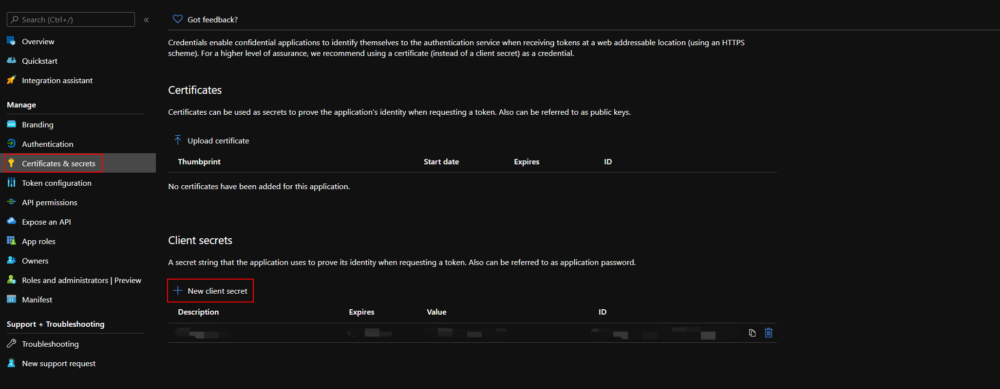

## aad.AadGetSkipAppConfigError

### Error Message

Failed to get all necessary info. You need to set objectId, clientId, clientSecret, oauth2PermissionScopeId under fx-resource-aad-app-for-teams in `state.{envName}.json`.

### Mitigation

Root cause of this error is that necessary info is not included in env.default.json file. To correctly skip creating new Azure AD app, please follow the instruction and make sure required info is included in your file.

#### Step #1 Collect Object Id and Client Id for Azure AD App
1. Go to Azure Portal, select "Azure Active Directory"
1. Select "App Registrations" and select you Azure AD app.
1. Select "Overview" and you can find client id and object id as follows:

    

### Step #2 Collect Client Secret for Azure AD App
1. Go to the Azure AD app owner for the secret or if create a new secret as follows:
   
   Select "Certificates & secrets", select "New client secret" and fill in required info to get the secret.

    

### Step #3 Collect Oauth Scope Id for Azure AD App
1. Select Manifest, find "id" under "oauth2Permissions".

    

### Step #4 Update config file
    
1. For provision:

    

    For local debug:

    

    *Note: You also need to add secret in default.userdata file with the key in your env.default.json file as following.*

    

## aad.AadGetAppError

### Error Message

Failed to get app info with current Object Id in `.fx/state/state.${env}.json`. Please make sure object id is valid, or delete 'objectId' under fx-resource-aad-app-for-teams in `.fx/state/state.${env}.json` and try again.

### Mitigation

Root cause of this error is that toolkit can not find Azure AD app with the same object id saved in your "env.default.json" file. Please follow the instruction following to address the error.

1. Open `.fx/state/state.${env}.json` file
2. Find `fx-resource-aad-app-for-teams`. Note value of key *clientId*
3. Go to Azure Portal, login with the same account as the M365 account in toolkit, select "Azure Active Directory"
4. Select "App Registrations" and search for you Azure AD app by client id noted above.

If you can find your Azure AD app, please check your network status and try again.

If you can not find your Azure AD app, please check whether you logged in with the correct account. You can also remove objectId from `.fx/state/state.${env}.json` file and then try again.