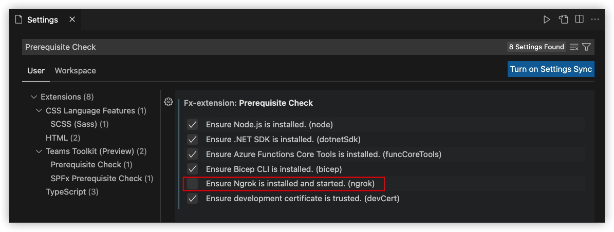
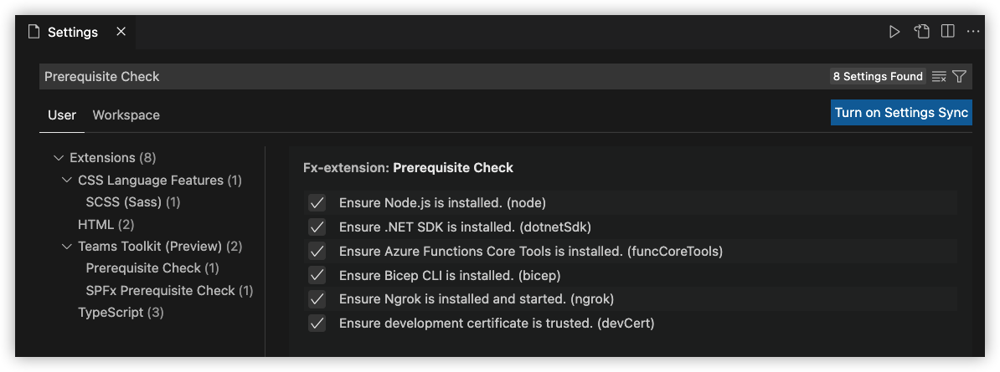

# Teams Toolkit Prerequisites Checker

Teams Toolkit checks the following prerequisites during the debug process:

* Node.js, applicable for the following project types:
  |Project type|Node.js LTS version|
  | --- | --- |
  |Tab | 14, **16 (recommended)** |
  |SPFx Tab | 12, **14 (recommended)**|
  |Bot |  14, **16 (recommended)** |
  |Message extension | 14, **16 (recommended)** |
  
* Microsoft 365 account with valid credentials, the Teams toolkit prompts you to sign in to Microsoft 365 account, if you haven't signed in.

* Custom app uploading or sideloading for your developer tenant is turned on, if not then the local debug terminates .

* Ngrok binary version 2.3 is applicable for bot and message extension, if Ngrok isn't installed or the version doesn't match the requirement, the Teams toolkit installs Ngrok NPM package `ngrok@4.2.2` in `~/.fx/bin/ngrok`. The Ngrok binary is managed by Ngrok NPM package in `/.fx/bin/ngrok/node modules/ngrok/bin`.

* Azure Functions Core Tools version 4, if Azure Functions Core Tools is'nt installed or the version doesn't match the requirement, the Teams Toolkit installs Azure Functions Core Tools NPM package, azure-functions-core-tools@4 for **Windows** and for **macOs** in  `~/.fx/bin/func`. The Azure Functions Core Tools NPM package in  `~/.fx/bin/func/node_modules/azure-functions-core-tools/bin` manages Azure Functions Core Tools binary. For Linux, the local debug terminates.

* .NET Core SDK version applicable for Azure Functions, if .NET Core SDK is'nt installed or the version  doesn't match the requirement, the Teams Toolkit installs .NET Core SDK for Windows and MacOS in `~/.fx/bin/dotnet`. For Linux, the local debug terminates.

  The following table lists the .NET Core versions:
  | Platform  | Software|
  | --- | --- |
  |Windows, macOs (x64), and Linux | **3.1 (recommended)**, 5.0, 6.0 |
  |macOs (arm64) |6.0 |

* Development certificate, if the development certificate for localhost is'nt installed for tab in Windows or macOS, the Teams toolkit prompts you to install it.

* Azure Functions binding extensions defined in `api/extensions.csproj`, if Azure Functions binding extensions is not installed, the Teams Toolkit installs Azure Functions binding extensions.

* NPM packages, applicable for tab app, bot app, message extension app, and Azure Functions. If NPM is'nt installed, the Teams Toolkit installs all NPM packages.

* Bot and message extension, the Teams Toolkit starts Ngrok to create an HTTP tunnel for bot and message extension.

* Ports available, if tab, bot, message extension, and Azure Functions ports are unavailable, the local debug terminates.

  The following table lists the ports available for components:

  | Component  | Port |
  | --- | --- |
  | Tab | 53000 |
  | Bot or message extension | 3978 |
  | Node inspector for bot or message extension | 9239 |
  | Azure Functions | 7071 |
  | Node inspector for Azure Functions | 9229 |

## Install Teams app development prerequisites manually

In case the Teams Toolkit fails to install prerequisites for you, you can manually install them by following the guidelines below.

### How to install Node.js

Go to [the official site](https://nodejs.org/en/about/releases/) to download and install the node.js. You may check for the node.js version requirements for differnet project types:

|Project type|Node.js LTS version|
| --- | --- |
|Tab | 14, **16 (recommended)** |
|SPFx Tab | 12, **14 (recommended)**|
|Bot |  14, **16 (recommended)** |
|Message extension | 14, **16 (recommended)** |

> Note: Please restart all your Visual Studio Code instances after the installation is finished.

### How to install .NET SDK

Go to [the official website](https://dotnet.microsoft.com/download) to download and install the supported version:

| Platform | .NET versions |
| --- | --- |
| Windows, macOS (x64), Linux | **.NET Core 3.1 SDK (recommended)**, .NET 5.0 SDK, .NET 6.0 SDK  |
| macOS (arm64) | .NET 6.0 SDK |

> Note: Please restart all your Visual Studio Code instances after the installation is finished.

### How to install Azure Functions Core Tools

Go to [the official website](https://github.com/Azure/azure-functions-core-tools) to install the `Azure Functions Core Tools v4`.

> Note: Please restart all your Visual Studio Code instances after the installation is finished.

### How to install Bicep CLI

Go to [the official website](https://docs.microsoft.com/azure/azure-resource-manager/bicep/install#install-manually) to install the `Bicep CLI v4`.

> Note: Please restart all your Visual Studio Code instances after the installation is finished.

## Troubleshooting

### NodeNotFound

> Cannot find Node.js. Go to https://nodejs.org/about/releases/ to install Node.js (v16 is recommended).

As the Teams Toolkit project is implemented by `Node.js`, it's required to install the npm pacakges and run the project in local.  

To resolve this, please refer to [How to install Node.js?](#how-to-install-nodejs) to install `Node.js`.

### NodeNotSupported (Azure hosting)

> Node.js (*node_version*) is not in the supported version list (v14, v16).

When `Azure` is selected as the hosting type and the project does not contain Azure Functions, only LTS versions (v14 and v16) of Node.js are supported by Teams Toolkit currently, please make sure the installed Node.js meets this requirement. In addition, **Node v16 (LTS)** would be recommended to be installed.

To resolve this, please refer to [How to install Node.js?](#how-to-install-nodejs) to install the supported version of `Node.js`.

### NodeNotSupported (Azure Functions)

> Node.js (*node_version*) is not in the supported version list (v14, v16).

When `Azure` is selected as the hosting type and the project contains Azure Functions, only LTS versions (v14 and v16) of Node.js are supported by Teams Toolkit currently, please make sure the installed Node.js meets this requirement. In addition, **Node v16 (LTS)** would be recommended to be installed.

To resolve this please refer to [How to install Node.js?](#how-to-install-nodejs) to install the supported version of `Node.js`.

### NodeNotSupported (SPFx hosting)

> Node.js (*node_version*) is not in the supported version list (v12, v14).

The SharePoint Framework v1.12.1 is supported on the following Node.js versions:

- Node.js v10.13.0+ (Dubnium)
- Node.js v12.13.0+ (Erbium)
- Node.js v14.15.0+ (Fermium)  

And **the latest version of Node.js LTS v14** would be recommended to be installed. For details, please refer to this [document](https://docs.microsoft.com/sharepoint/dev/spfx/set-up-your-development-environment#install-nodejs).

To resolve this please refer to [How to install Node.js?](#how-to-install-nodejs) to install the supported version of `Node.js`.

### <a name="functionDepsCheckerfailtoinstalldotnet"></a>FailToInstallDotnet

> Failed to install .NET Core SDK (v3.1). Install .NET Core SDK (v3.1) manually and restart Visual Studio Code.

It might be caused by timeout issue (longer than 3 minutes), the process to install `.NET SDK` is killed, or other unknown issues. 

To resolve this, please follow below instrucntion:

* Retry the operation (local debugging or Function app deployment).

* Please refer to [the guide](#how-to-install-net-sdk) to install `.NET SDK` manually.

> Note: For M1 Mac users, currently neither `.NET 5.0 SDK` or `.NET Core 3.1 SDK` supports M1 Mac (see [this GitHub issue](https://github.com/dotnet/core/issues/4879)).

### <a name="functionDepsCheckerdotnetnotfound"></a>DotnetNotFound

> Cannot find .NET Core SDK (v3.1 or v5.0). For the details why .NET SDK is needed, refer to https://aka.ms/teamsfx-envchecker-help

To resolve this issue, please refer to [the guide](#how-to-install-net-sdk) to install `.NET SDK` manually.

### <a name="functionDepsCheckerdotnetnotsupporttargetversion"></a>DotnetNotSupportTargetVersion

> NETSDK1045: The current .NET SDK does not support 'newer version' as a target.

To resolve this issue, please refer to [the guide](https://docs.microsoft.com/dotnet/core/tools/sdk-errors/netsdk1045#globaljson-file) to check your `global.json` file in the root folder in your project and up the directory chain to the root of the volume, since it can be anywhere in the folder structure. If it contains an SDK version, delete the sdk node and all its children, or update it to the desired newer .NET Core version (`.NET 5` or `.NET Core 3.1` ).

The `global.json` file is not required, so if it doesn't contain anything other than the sdk node, you can delete the whole file.

### FailToInstallNgrok

> Failed to install ngrok@4.2.2. Install ngrok@4.2.2 manually.

Since Bot and Message extension require public endpoint for communication, Teams Toolkit by default uses a built-in ngrok to create a tunnel connection forwarding localhost address to public address.

To resolve this issue, you can use your own tunneling service, please follow below instructioins:

1. Uncheck the `Ensure Ngrok is installed and started` setting
    * Use Settings in Visual Studio Code

    
    * Or execute command `teamsfx config set validate-ngrok off` with [TeamsFx CLI](https://aka.ms/teamsfx-cli) in the terminal.
1. Set the configurations in *.fx/configs/config.local.json* under the project root, then start debugging.

    ``` json
    
        "bot": { 
    
            "siteEndpoint": "https://767787237c6b.ngrok.io" 
    
        } 
    
    ```

> Note: the `botEndpoint` should use https protocol.

## Prerequisites Checker Settings

If you prefer to manage some or all of the Teams app development prerequisites your self, you can use Visual Studio Code settings (Visual Studio Code Settings -> Teams Toolkit -> Prerequisite Check) to diasable the prerequisite checker. To open your user and workspace settings, use the following Visual Studio Code menu command:

* On Windows/Linux - **File > Preferences > Settings > Extensions > Teams Toolkit**
* On macOS - **Code > Preferences > Settings > Extensions > Teams Toolkit**



## <a name="functionDepsCheckerreport-issues"></a>Report issues  

If this document cannot solve the issue you met, please click [here](https://github.com/OfficeDev/Teamsfx/issues/new) to submit an issue on GitHub and attach the log from Visual Studio Code output channel named `Teams Toolkit`.
